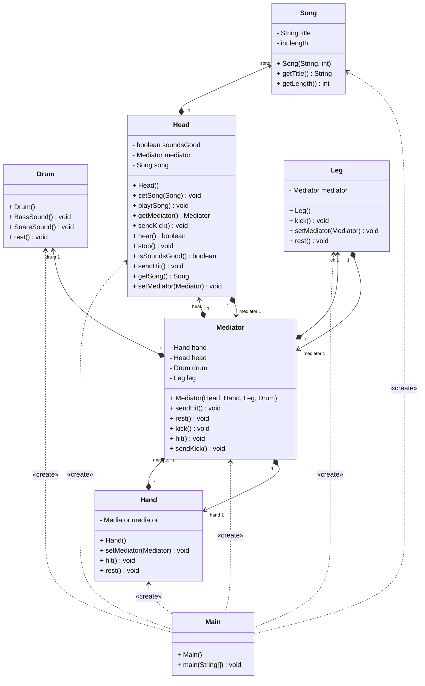

# Patron de conception Médiateur

## Illustré avec l'exemple d'un joueur de batterie

### Pourquoi il existe, description

Le patron médiateur existe pour solutionner des projets où beaucoup de composants sont interdépendants, ce qui peut rendre le code confus. Changer une méthode d'un composant qui en implique deux à trois autres peux nécessiter d'aller fouiller dans ces autres classes pour les modifier, ce qui complexifie toute modification ultérieure. Ajouter un composant dans ce modèle peut devenir inutilement ardu.

En proposant une classe médiatrice qui centralise les transmissions de tous les composants interdépendants, on permet une régulation efficace du traffic des méthodes. Un composant n'a plus à se soucier de gérer tous les composants affectés par une de ses méthodes, il envoie juste sa requête au Médiateur qui passera le message aux concernés. La dépendance s'en trouve allégée et peut être facilement modifiée au sein du médiateur.

### Exemple dans une bibliothèque Java
Dans la librairie java.util.concurrent on trouve l'interface ScheduledExecutorService, qui contient des méthodes de médiation telles que les schedule(..params...). La classe qui l'implémente est ScheduledThreadPoolExecutor. Elle intègre plusieurs classes qui ont besoin de collaborer étroitement: les classes ScheduledFutureTask, DelayedWorkQueue et Worker (task, queue et thread).
En gérant les interactions entre "task" et "queue" par exemple, le ScheduledThreadPoolExecutor fait office de Mediator pour ces 2 classes, et leur évite un couplage direct. Ainsi "task" n'aura pas besoin d'intégrer "queue" et inversement. Pour communiquer entre elles, elles utiliseront le médiateur ScheduledThreadPoolExecutor à la place.

